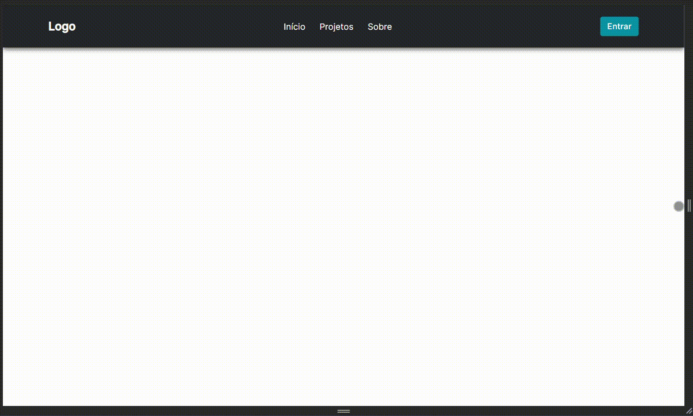

# Projeto Header Responsivo

Este projeto oferece um cabeçalho responsivo utilizando HTML, CSS e JavaScript. O cabeçalho inclui uma barra de navegação com links para "Início", "Projetos" e "Sobre", além de um botão de login. A versão móvel do cabeçalho é ativada quando a largura da tela é inferior a 730 pixels.

## Demo 📸
<div align="center" >
  
</div>

## Estrutura do Projeto

- **index.html**: Este arquivo HTML contém a estrutura básica da página, incluindo o cabeçalho responsivo.

- **style.css**: O arquivo CSS fornece estilos para a aparência e layout do cabeçalho em diferentes tamanhos de tela.

- **script.js**: No arquivo JavaScript, há uma função simples chamada `menuShow()`. Esta função alterna a visibilidade do menu móvel quando o ícone correspondente é clicado.

## Como Utilizar

1. Clone ou faça o download deste repositório para a sua máquina.

```bash
git clone https://github.com/leandrosuy/header_responsivo.git
```

2. Abra o arquivo `index.html` em seu navegador web para visualizar o cabeçalho responsivo.

## Personalização

Você pode personalizar este projeto conforme necessário. Algumas sugestões incluem:

- **Alteração de Cores**: Modifique as cores no arquivo `style.css` para refletir a identidade visual desejada.

- **Atualização de Links**: Atualize os links no arquivo `index.html` para direcionar para as páginas desejadas.

- **Adição de Conteúdo**: Acrescente mais elementos ao cabeçalho ou à página conforme necessário.

## Como Funciona o script.js

O arquivo `script.js` contém uma função chamada `menuShow()`. Esta função é responsável por alternar a visibilidade do menu móvel quando o ícone correspondente é clicado. Aqui está uma explicação detalhada:

```javascript
function menuShow() {
    let menuMobile = document.querySelector('.mobile-menu');

    if (menuMobile.classList.contains('open')) {
        menuMobile.classList.remove('open');
        document.querySelector('.icon').src = "assets/img/menu_white.svg";
    } else {
        menuMobile.classList.add('open');
        document.querySelector('.icon').src = "assets/img/close_white.svg";
    }
}
```

- A função `menuShow()` é chamada quando o botão do ícone do menu é clicado.

- `document.querySelector('.mobile-menu')` seleciona o elemento com a classe 'mobile-menu', representando o menu móvel.

- `classList.contains('open')` verifica se a classe 'open' está presente, determinando se o menu está aberto ou fechado.

- Se o menu estiver aberto, a função o fecha (removendo a classe 'open') e troca o ícone para o ícone do menu. Se estiver fechado, a função o abre (adicionando a classe 'open') e troca o ícone para o ícone de fechar.

Essa lógica proporciona um efeito de abertura e fechamento do menu móvel, melhorando a experiência do usuário em dispositivos com tela menor.

<a href="https://raw.githubusercontent.com/ARTHURPC03/Proffy-FullStack/master/github/linkedin.png">
</a>


Veja meu Linkedin: [Leandro Dantas](https://www.linkedin.com/in/leandro-dantas-1959b711b/)